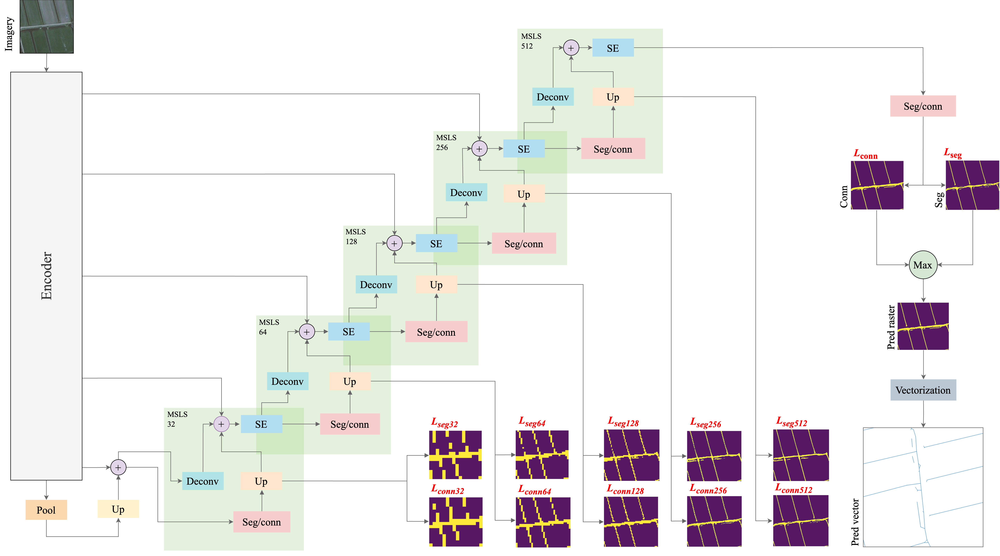

# CadNet: a Deep Learning Model with Enhanced Line Connectivity for Cadastral Boundary Delineation

## Abstract
Cadastral mapping is a critical component of establishing a legal land administration system. Currently, an
estimated 70% of the global population lacks access to formalized
land rights through such systems, highlighting the urgency of
accelerating the mapping of property rights. This study intro-
duces an innovative methodology that integrates advanced deep
learning techniques with remote sensing imagery to automate
the extraction of cadastral boundaries. Our proposed model,
CadNet, significantly outperforms baseline models. Moreover,
CadNet is trained on a more extensive and diverse dataset
than recent studies in this field. The results demonstrate a
robust framework for advancing research in cadastral mapping
leveraging deep learning and remote sensing technologies.

## Table of Contents
- [Installation](#installation)  
- [Model](#model-architecture)  
- [Dataset](#dataset)  
- [Training](#training)  
- [Prediction](#evaluation)  
- [Contributing](#contributing)  
- [License](#license)  
- [References](#references)  

## Installation

1. Clone the repository:

    ```bash
    git clone https://github.com/jeroengrift/cadnet.git
    ```

2. Navigate to the project directory:

    ```bash
    cd cadnet
    ```

3. Create the Conda environment:

    ```bash
    conda env create -f environment.yml
    ```

4. Activate the environment:

    ```bash
    conda activate cadnet
    ```

## Model

Figure 1: CadNet architecture (updated).

## Prepare Dataset
The imagery and corresponding reference data used in this study are publicly available in the CadastreVision repository:
The imagery and reference data are hosted in the [CadastreVision repository](https://github.com/jeroengrift/cadastrevision).

> Note: The original 8 cm leaf-off imagery (for this resaech resampled to 25 cm) is not available due to storage constraints. Please use the provided 25 cm leaf-on tiles if you would like to perform the experiment. The used data for this paper will be published later.

Follow these steps to preprocess the data:

1. Download these raster tiles and put them in the following directories in this root dir: `data/cad_aerial_8_sub`
    - `/train/images`:
        - `tile-40000-380000.tif`
        - `tile-40000-390000.tif`
        - `tile-110000-430000.tif`
        - `tile-110000-560000.tif`
        - `tile-120000-440000.tif`
        - `tile-180000-400000.tif`
        - `tile-180000-540000.tif`
        - `tile-190000-560000.tif`
        - `tile-200000-510000.tif`
        - `tile-210000-530000.tif`
        - `tile-210000-560000.tif`
        - `tile-210000-570000.tif`
        - `tile-230000-440000.tif`
        - `tile-230000-450000.tif`

    - `/validate/images`:
        - `tile-80000-400000.tif`
        - `tile-160000-490000.tif`
        - `tile-160000-550000.tif`

    - `/test/images`:
        - `tile-120000-430000.tif`
        - `tile-200000-540000.tif`

2. Download these vector files and place them in `data/cad_aerial_8_sub/reference`: 
    - `bestuurlijkegrenzen.gpkg`
    - `brk_reference.gpkg`
    - `brt_bebouwde_kom.gpkg`
    - `sample_tiles_10k_split.gpkg`

3. Create image patches (512x512) by using these config lines in a config file (`patches_25.py`):   
    ```yaml
    # Dataset preparation settings
    DATASETS:
        DATA_DIR: '/data/cad_aerial_8_sub'
        PATCHES_DIR: 'patches_25'
        IMAGES_DIR: 'images'
        IMG_SIZE: 512
        CREATE_PATCHES: True
        DOWNSAMPLE_FACTOR: 1.
    ```

4. Create reference data by running `cadnet/preprocess/enrich_reference.py`. Set the following configuration parameters:
    ```yaml
    # Configuration parameters
    type_reference: 'brk' # or topo if you want to predict topo boundaries
    pixel_size_patch: 25 # the pixel size of the patches
    ```

5. Create an urban/rural patch classification to exclude urban areas by running `cadnet/preprocess/urban_patches.py`. Set the configuration parameters as follows:

    ```yaml
    # Configuration parameters for urban patch classification
    input_dir: 'cad_aerial_8_sub_test'
    pixel_size_patch: 25
    in_dir: 'data/cad_aerial_8_sub_test'
    urban_file: 'data/cad_reference/brt_bebouwde_kom.gpkg'
    ```

## Train
1. In `config.yaml`, set:
    ```yaml
    RUN_TYPE: 'train'
    ```
2. Launch training:
    ```bash
    nohup python run/run_aerial_8_25.py --config config/IGARSS_paper/swinunet_multi_coa.yaml &
    ```
3. Monitor training process and select the best model (take into account early stopping!)

## Evaluate

1. Update your `config.yaml` for prediction:

    ```yaml
    RUN_TYPE: "predict"
    TRAINED_MODEL: "model_00000.pth" # check name of checpoint
    ```

2. Run the inference:

    ```bash
    nohup python run/run_aerial_8_25.py --config config/IGARSS_paper/swinunet_multi_coa.yaml &
    ```

3. Review the generated predictions in the `cadnet/outputs/` directory.
4. Collect all the outputs by running `/cadnet/run/read_predict_all.py`

## Results
Table 1 summarizes the quantitative performance of each model configuration on the test set. Metrics include Precision, Recall, F1 Score, and Normalized Discprepant Area (NDA). The best score in each column is highlighted in bold.

| Model                       | Precision | Recall | F1 Score | NDA Ref (km²) | NDA Pred (km²) | NDA Total (km²) |
|----------------------------|-----------|--------|----------|----------------|-----------------|------------------|
| ResUnet                    | 0.317     | 0.400  | 0.354    | 10.782         | 24.100          | 34.882           |
| ResUnet + CoA              | 0.332     | 0.388  | 0.358    | 11.710         | 23.710          | 35.419           |
| ResUnet + MSLS             | 0.345     | 0.381  | 0.362    | 12.266         | **22.223**      | 34.489           |
| ResUnet + MSLS + CoA       | 0.319     | 0.428  | 0.366    | 10.826         | 24.126          | 34.951           |
| SwinUnet                   | **0.347** | 0.369  | 0.358    | 12.252         | 23.248          | 35.501           |
| SwinUnet + CoA             | 0.315     | 0.416  | 0.358    | 11.060         | 23.926          | 34.985           |
| SwinUnet + MSLS            | 0.333     | 0.418  | 0.371    | **10.585**     | 22.906          | 33.491           |
| SwinUnet + MSLS + CoA      | 0.327     | **0.433** | **0.372** | 10.678         | 22.599          | **33.277**  

## Use as reference

```bibtex
@inproceedings{griftcadnet,
    title     = {CadNet: a Deep Learning Model with Enhanced Line Connectivity for Cadastral Boundary Delineation},
    author    = {Grift, Jeroen, Persello, Claudio and Koeva, Mila},
    booktitle = {IEEE International Geoscience and Remote Sensing Symposium 2025},
    pages     = {},
    year      = {2025},
    doi       = {}
}
```
